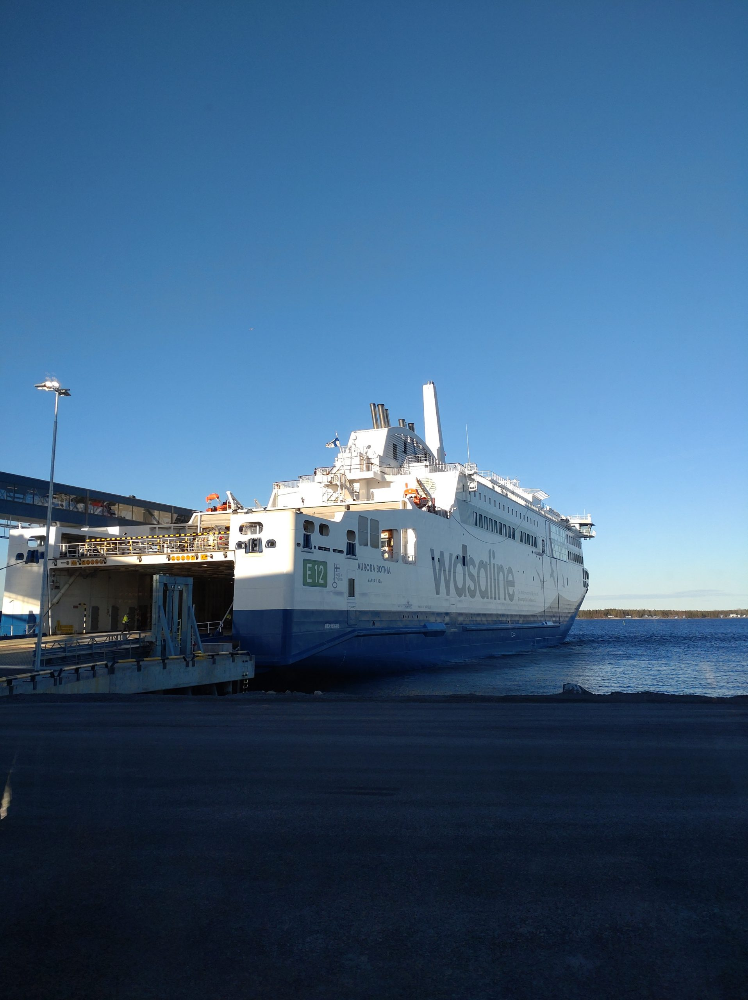

En av maj månads höjdpunkter var Vasaresan. Vi blev tre glada turfare som åkte -stefanx46, roswes67 och Tacitium.

På båtresan dit på fredagskvällen var det feststämning ombord. Det var lite lustigt när jag stod i Holmsund och funderade på om jag skulle checka in. Väldigt lång kö till incheckningsluckan! Jag hade ju fått boardingcard i mobilen så varför checka in? Det slutade med att jag chansade och gick ombord - jag hade ju boardingcard, liksom.

De andra hade med sig cyklar som de tog ombord. Jag chansade lite och tänkte låna en cykel i Vasa. I värsta fall skulle jag få gå runt lite och det kan ju vara trevligt med en promme också ;) Båtresan kostade 399 kr för en enkelresa med 75 kr tillägg för cykel. Det går att boka hotellpaket samtidigt då kan det bli lite bök om man tar med egen cykel...

Kan rekommendera Scandic Waskia att bo på. Det ligger nära Tropiclandia. Frukosten var fantastisk och jag fick ett rum med havsutsikt. Jag hade till och med en egen bastu! Det gick att låna en cykel. Väldigt bra cykel med små hjul. Äntligen fick den lilla cykeln ta sig runt hela Vasa!

stefanx46 och den lilla cykeln.

Vasa i sig hade en liten ås, samtidigt var det väldigt lättcyklat och zonerna låg på bra platser. Vädret under resan var överlag väldigt fint. Det regnade lite när vi åt lunch, tog en kaffe och en kaffekarlsson innan middagen på restaurang Strampen.

Tacitium, stefanx46 och roswes67 på Strampen

Gott på Strampen

Och ännu mera gott, också på Strampen

På båtresan tillbaka var jag väldigt nöjd över att ha rensat Vasa på unika zoner. Roswes67 var nöjd av att ha kronan (hon tappade tyvärr den ganska snabbt), Tacitium var nöjd över att ha chans på R-medalj. Han fick kämpa hårt med att inte turfa för att vinna sitt första R!

Här är några av de många fina zoner vi tog:

Skrivet av  
Stefanx46  
2022-06-06
