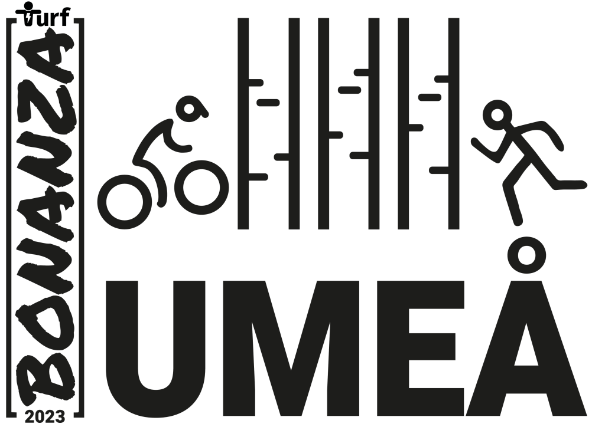
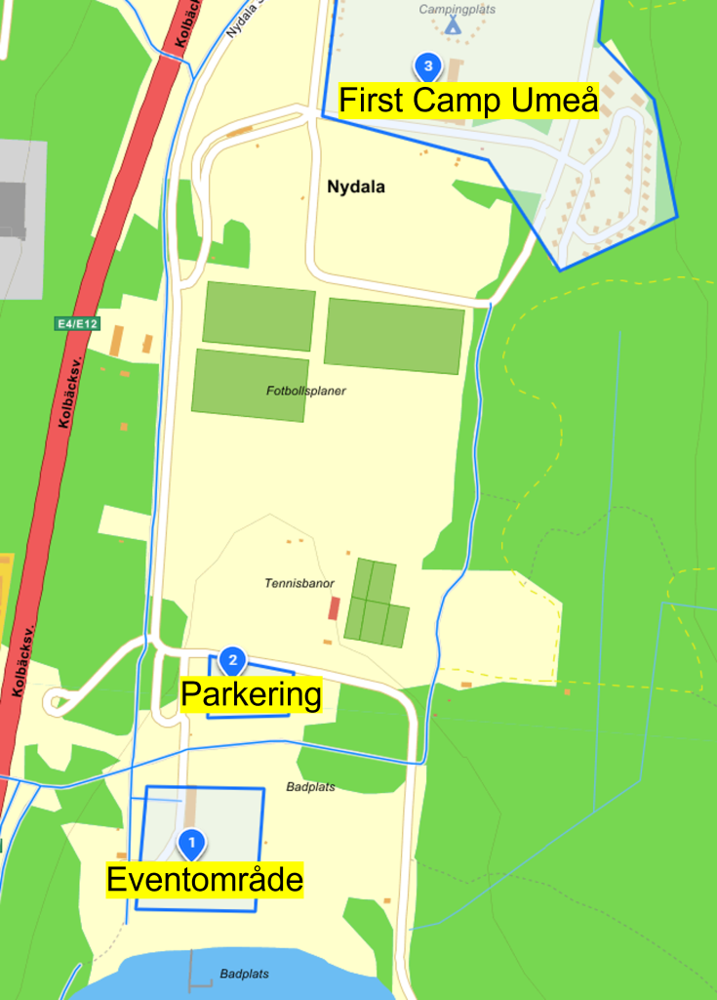

Föreningen Turf Västerbotten och Turf Crew bjuder in alla turfare till

# Turf Bonanza i Umeå 20 maj 2023

[Anmäl dig nu!](https://forms.gle/NwnnUrmim8hN3fQo7)  

**_Detta inlägg uppdateras löpande med den senaste informationen!_**

## Den nordligaste Bonanzan

Umeå, björkarnas stad, har fått äran att anordna den 13:e upplagan av Turf Bonanza, vilket passar utmärkt eftersom Umeå, Norrlands huvudstad, är den 13:e största tätorten i Sverige (2021). Det kommer att bli den nordligast belägna Bonanzan hittills.

Umeå har gott om gång- och cykelvägar och erbjuder över 700 unika turfzoner. För den som vill utforska mer av Västerbotten finns ytterligare drygt 1300 zoner och Sveriges (tuffaste?) turf-klassiker.

Mer om Umeå som besöksmål finns att läsa på [https://visitumea.se/sv](https://visitumea.se/sv)

## De två heaten

Bonanzan 2023 kommer att genomföras i två heat:

1. **Heat 1 - Bonanza Foot  
    **Startar kl 10:00 och är ett renodlat gå-/springevent 

3. **Heat 2 - Bonanza Bike  
    **Startar kl 13:00 och är enbart till för cyklister eller turfare som använder sig av andra icke eldrivna fordon.  
    _Elcykel kan tillåtas för deltagare med funktionsnedsättning. Ansök om dispens via_ [_bonanza@turfvasterbotten.se_](mailto:bonanza@turfvasterbotten.se) 

Varje heat pågår under 2 timmar. Medaljerna Bonanza Guld, Silver och Brons samt Bonanzamedalj kommer att delas ut i båda heaten.

Vinnarna av respektive heat vinner också fina priser som presenteras här inom kort. Det kommer även att finnas en **ungdomsklass,** upp till 18 år, där delas det ut särskilda priser.

Prisutdelningen sker på eventområdet cirka 30 minuter efter varje heat.

## Eventområde & parkering

Eventet kommer att ha sin utgångspunkt vid Nydalabadet, nära E4:an (närmsta zon: [UmeBeach](https://turfgame.com/map/umebeach)). I anslutning till eventområdet ligger First Camp Umeå ([mer info finns under boende](#boende)). Området öppnar kl. 09.00 och stänger ca. kl. 16.30.

Karta över eventområdet

Här finns tillgång till omklädningsrum, toalett och dusch. Vi täcker eventområdet med gratis WiFi och det finns även eluttag för laddning av mobiltelefoner och batteripack. Vi erbjuder dig även att förvara mindre väskor här under tävlingen.

Gratis parkeringsplatser för eventdeltagare finns cirka 50 meter från samlingsplatsen (nr 2 på kartan). Kom i god tid innan ditt heat startar eftersom området är populärt för frilufts- och sportaktiviteter.

**På eventområdet kommer du dessutom bland annat kunna...** (klicka för att läsa mer)

- Checka in och hämta ut din goodiebag (om du är en av de första 100 som anmäler sig).

- Glida runt och träffa andra turfare. 

- Köpa något gott i vår egen eventkiosk _GrillZone_ (överskottet går till Bonanzan). 

- Ladda upp inför start till bra musik! 

- Följa båda heaten live via storbildsskärm med web-sändningar från tävlingsområdet och via turfgame.com.

- Träffa Turf Crew och få svar på alla tänkbara frågor om Turf.

- Hämta ut dina beställda Bonanza-prylar. 

- Köpa Turf-lotter och delta i olika tävlingar.

- Delta i rekordförsök av crowdy (flest antal turfare som tar en zon samtidigt). 

- Se de senaste cykelmodellerna och få cykelservice av en av våra lokala cykelhandlare i Umeå – [CM Cykel och Fritid AB](https://www.cmcykel.se/). Vi är stolta att CM Cykel och Fritid sponsrar och stöttar eventet genom att vara på plats och reparera/serva cyklar mot en billig penning samt sälja hjälmar och andra cykeltillbehör.

Utöver vår eminenta eventkiosk _GrillZone_ så finns mataffärer, pizzeria och Burger King på Mariehem Centrum (ca 900 meter från eventområdet).

## Bonanza-banketten

Kl 18:30 så rullar vi ut röda turfmattan och hälsar alla välkomna till Cinco Restaurante (nära zonen [RenastLuft](https://turfgame.com/map/renastluft)).

Banketten kostar 400 kronor och då ingår en fin tvårättersmiddag samt bästa umgänget! Under kvällen kommer det att bli utdelning av Turf Awards, upptåg, tävlingar, och en massa trevligt häng - helt enkelt en efterfest du inte vill missa!

Boka din plats på banketten i anmälningsformuläret!

## Merch/Stötta Turf Västerbotten

Att delta på en Bonanza ska självklart vara gratis, därför så tar vi inte ut någon anmälningsavgift. Dock så är vi beroende av intäkter för att kunna genomföra en Bonanza, när du [anmäler dig](https://forms.gle/NwnnUrmim8hN3fQo7) så passa därför gärna på att lägga en beställning på vår exklusiva Bonanzatröja för endast 250 kr i funktionsmaterial och 200 kr i bomull.

## Anmäl dig tidigt - betala mindre!

Ordinarie pris för banketten är alltså 400 kr och för Bonanzatröjan 250/200 kr, totalt 650/600 kr - men du som [anmälde dig](https://forms.gle/NwnnUrmim8hN3fQo7) senast 2023-02-14 betalar bara 599/549 kr! Då ingår dessutom en värdekupong som du kan använda i vår Bonanzakiosk, GrillZone samt kanske någon mer överraskning...

## Tips på boenden

Turf Västerbotten har samarbete med två boenden som erbjuder rabatterade priser under Bonanza-helgen. Vi rekommenderar därför varmt boende på First Camp Umeå (c:a 500 m från eventområdet, 5,5 km från banketten) eller Hotell Gamla Fängelset (c:a 4,5 km från eventområdet, 900 m från banketten).

**Bo i en cell** (klicka för att läsa mer)

Gamla fängelset erbjuder unikt och prisvärt boende i en historisk byggnad som är varsamt renoverat för att behålla fängelsets ursprungliga miljö. Fängelset byggdes 1861 och är Umeås äldsta stenbyggnad som klarade sig från stadsbranden år 1888. Sedan 2008 är det ombyggt till ett hotell och i samband med Bonazan erbjuder de extra bra priser:

Enkelrum 650:- (ord. 725:-)  
2-bäddsrum: 800:- (ord 895:-)  
Dubbelrum: 900:- (ord. 995:-)  
4-bäddsrum: 1395:- (ord. 1495:-)  
I priserna ingår:  
Logi/dygn inkl. frukostbuffé, sänglinne, handduk, morgonrock, fräscha delade duschar & toaletter (dam/herr/singel), wi-fi, parkering.  
Bokningskod: TURF23  
Bokning: Bokas via info@hotellgf.se, https://www.hotellgf.se/kontakta-oss/  
OBS! Uppge bokningskoden vid bokningstillfället för att få tillgång till rabatterat pris  
(Eftersom vi har blockat hela hotellet så går det inte att göra en bokning via vår ”bokningssida” med koden på vår hemsida innan 15/2)

**Bo på camping** (klicka för att läsa mer)

Hos First Camp Nydala får ni 20% rabatt om ni uppger koden Bonanza2023 i er anmälan till telefon 090-70 26 00. Rabatten gäller under hela veckan, måndag 15/5 till söndag 21/5. På First Camp finns  bl a stugor men även tillgång till husvagns-/husbilsplats

Glöm inte att ange rätt bokningskod vid bokning!

## Frågorna du inte visste att du hade

_Finns det risk för snö?_

- Det finns en risk, men det kan lika gärna vara vara +20°C.

_Behöver jag ta med myggmedel?_

Myggsäsongen har sannolikt inte dragit igång, men för den känsliga kan myggmedel köpas på närmsta apotek.

_Blir det mörkt på natten?_

Solen går ner, men det kommer att vara ljust långt in på kvällen.

_Kan jag få se norrskenet?_

Troligen inte denna tid på året, men [du kan läsa om det här](https://visitumea.se/sv/norrskensguide-umea).

_Vad äter en västerbottning?_

Västerbottensost, viltkött, lingon, blåbär, hjortron…

_Går det runt älgar på stan?_

Ja, ibland. Men de trivs bäst i skogen.

_Hur tar jag mig till Umeå?_

Det går tåg från Stockholm, Göteborg och Norrbotten, flyg från Stockholm samt färja från Vasa, Finland. [Här kan du läsa mer om att resa till Umeå.](https://visitumea.se/sv/res-till-umea)

<iframe src="https://docs.google.com/forms/d/e/1FAIpQLSfr2Uo2gBgkvHx-laxMeXEmY847TokwtVnfHdcn1WiF4VMBkw/viewform?embedded=true" width="640" height="1651" frameborder="0" marginheight="0" marginwidth="0">Läser in&nbsp;…</iframe>
