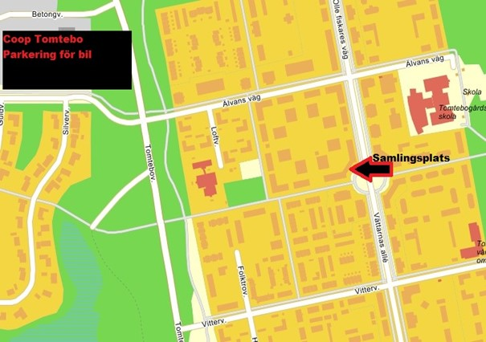

There is a difference between winter and winter! To experience a real winter event come to the Västerbotten Winter Classic!

## When?

Saturday, 18 February 2023.

Start time: 13.00  
End time: 15.00

## Where?

The districts of Tomtebo, Ålidhem and the Campus, Umeå.

### Event area

The gathering point will be the BRF (housing society) Nornan's assembly room, Älvans Väg 158 (3 stairs), see the map below (nearest zone [Ratatosk](https://turfgame.com/map/Ratatosk)). There will be access to showers, sauna and WC close to the assembly room.

Outside you will be able to barbecue food you have brought, the fire will be lit from approx. 12:00. You will also be able to follow the event via a large screen TV inside in the gathering room, where the award ceremony also will take place. In addition, you will have the oppurtunity to meet other turfers as well as the board of the Turf Västerbotten Association.

## Class division

**Two classes:**

1. Bicycle class - only for non-electric cyclists.

3. Foot class. This also includes skis, kicks or the like.

There will also be a youth class up to 18 years of age.

## Prizes

Prizes will be awarded to 1st, 2nd and 3rd in all classes. This also applies to the youth class. All participants also receive the Event medal in the app.

## After event

After the event, we will meet at restaurant Cinco at 18:00 for some dinner (own expense) and a nice evening together.

## Safety

We strongly recommend the use of a bicycle class helmet.  
Lighting where necessary is also preferred.  
Of course, we follow traffic rules and show consideration for others.  
In the event of an accident, contact 112, if deemed necessary, and if possible contact the event management.

The event is organized by the Association Turf Västerbotten, which means that the sports movement's operating concept, vision and values ​​apply during the competition itself.

## Registration

As this is an open event, no registration is required, but to ease the zone planning, so that the correct number of zones are created, please register in the [registration form](https://forms.gle/VKo6v3ddKCHmfzXm8). **The last date for registration is 2023-02-13**.

<iframe src="https://docs.google.com/forms/d/e/1FAIpQLScylnuFeoNvJmi0TNUdwKpQPlKm85Fl5Oc_QEVYziPBfZgQJg/viewform?embedded=true" width="640" height="1382" frameborder="0" marginheight="0" marginwidth="0">Läser in …</iframe>

## About events

Event is a short competition where there are many specially placed zones with short distances, within a special area. Everyone has the same prerequisites regarding take time (30 sec) and blocking time (3 min). This is suitable for both new and seasoned turfers.

Walk, run or bike – do whatever suits you best at the moment.

Go hard for a win or just take a single zone.

[Read more about events on TurfWiki, via this link.](https://wiki.turfgame.com/en/wiki/Event)
