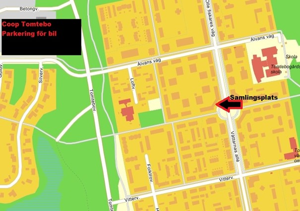

Det är skillnad på vinter och vinter! För att uppleva ett riktigt vinterevent kom till Västerbotten Winter Classic!

## När?

Lördag den 18 februari 2023.

Starttid: 13.00  
Sluttid: 15.00

## Var?

Stadsdelarna Tomtebo, Universitetsområdet samt Ålidhem, Umeå.

### Eventområde

Samlingsplatsen kommer att vara BRF Nornan´s samlingslokal, Älvans Väg 158 (3 trappor), se kartan nedan (närmaste zon [Ratatosk](https://turfgame.com/map/Ratatosk)). Det kommer att finnas tillgång till dusch, bastu och WC i anslutning till samlingslokalen.

Ute på gården kommer du att kunna grilla medhavd mat vid grillen, som kommer att vara tänd från ca:12:00, du kommer även att kunna följa eventet via en storbilds-TV uppe i samlingslokalen, där också prisutdelning kommer att ske. Dessutom kommer du att kunna träffa andra turfare samt styrelsen för föreningen Turf Västerbotten, som kommer att vara på plats.

## Klassindelning

**Två klasser:**

1. Cykel-klass - enbart för cyklister utan eldrift.

3. Fot-klass. Hit räknas även skidor, spark eller liknande in.

Det kommer även att finnas en ungdomsklass upp till 18 år

## Priser

Det kommer att delas ut priser till 1:an, 2:an samt 3:an i samtliga klasser. Det gäller även ungdomsklass. Alla deltagare får även Event-medaljen i appen.

## Efter eventet

Efter eventet så träffas vi på restaurang Cinco kl 18:00 för lite middag (på egen bekostnad) och en trevlig kväll tillsammans.

## Säkerhet

Vi rekommenderar starkt användning av hjälm i cykelklass.  
Belysning vid behov är också att föredra.  
Givetvis så följer vi trafikregler och visar hänsyn till andra.  
Vid olycka kontakta 112, om så bedöms, samt om möjligt kontakta eventledningen.

Eventet arrangeras av Föreningen Turf Västerbotten, vilket innebär att idrottsrörelsens verksamhetsidé, vision och värdegrund gäller under själva tävlingen.

## Anmälan

Då detta är ett öppet event så krävs ingen anmälan men för att underlätta för zonläggning, så att rätt antal zoner läggs ut så anmäl dig gärna i [anmälningsformuläret](https://forms.gle/P5GT1b2Mk3aTYuek8). **Sista anmälningsdatum är 2023-02-13**.

<iframe src="https://docs.google.com/forms/d/e/1FAIpQLScylnuFeoNvJmi0TNUdwKpQPlKm85Fl5Oc_QEVYziPBfZgQJg/viewform?embedded=true" width="640" height="1382" frameborder="0" marginheight="0" marginwidth="0">Läser in …</iframe>

## Om event

Event är en kort tävling där det finns många speciellt utlagda zoner med korta avstånd inom ett speciellt område. Alla har samma förutsättningar avseende tagningstid (30sek) och blockeringstid (3min). Detta är lämpligt för såväl nya som rutinerade turfare.

Gå, spring eller cykla – gör vilket du tycker passa bäst för dig för tillfället.

Satsa stenhårt för vinst eller bara ta någon enstaka zon.

[Läs mer om event på TurfWiki, via denna länk.](https://wiki.turfgame.com/sv/wiki/Event#Regler_f.C3.B6r_arrang.C3.B6rer)
